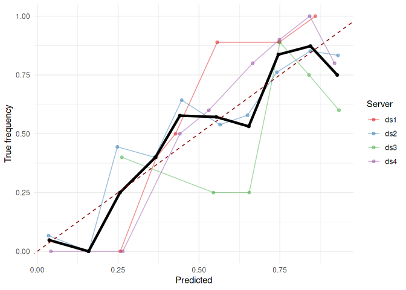
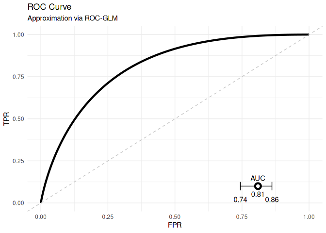
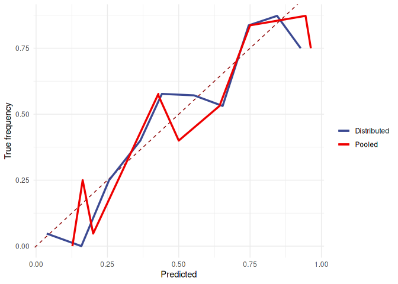
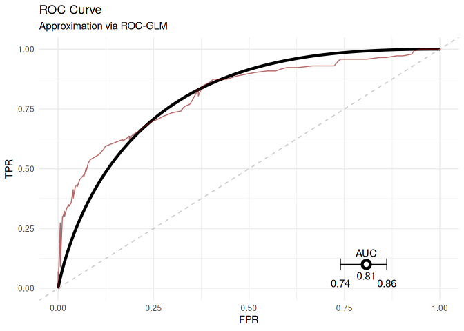

<!-- README.md is generated from README.Rmd. Please edit that file -->

# DataSHIELD Use-case

This repository contains a short use-case base on the three packages
`ds.predict.base`, `ds.calibration`, and `ds.roc.glm`. The main intend
is to have a short script which can be used for testing the
functionality of these packages.

The following contains the script for the use-case as well as the
output.

## DataSHIELD Setup

Install all packages locally and also on the DataSHIELD test machine.
Also fit a logistic regression, create a new project and upload the data
sets:

```` r
remotes::install_github("difuture-lmu/ds.predict.base")
#> Skipping install of 'ds.predict.base' from a github remote, the SHA1 (c824094f) has not changed since last install.
#>   Use `force = TRUE` to force installation
remotes::install_github("difuture-lmu/ds.calibration")
#> Skipping install of 'ds.calibration' from a github remote, the SHA1 (7b5a331b) has not changed since last install.
#>   Use `force = TRUE` to force installation
remotes::install_github("difuture-lmu/ds.roc.glm")
#> Skipping install of 'ds.roc.glm' from a github remote, the SHA1 (423520dc) has not changed since last install.
#>   Use `force = TRUE` to force installation

source(here::here("R/update-data.R"))
source(here::here("R/upload-data.R"))
#> ```
````

\#\> Importing KUM into DIFUTURE-TEST
\[===========================================\>———\] 83% / 1s Save
completed
\[=======================================================================\]
100% / 3s \#\> Importing MRI into DIFUTURE-TEST
\[===========================================\>———\] 83% / 1s Save
completed
\[=======================================================================\]
100% / 3s \#\> Importing UKA into DIFUTURE-TEST
\[===========================================\>———\] 83% / 1s Save
completed
\[=======================================================================\]
100% / 3s \#\> Importing UKT into DIFUTURE-TEST
\[===========================================\>———\] 83% / 1s Save
completed
\[=======================================================================\]
100% / 3s source(here::here(“R/create-log-reg.R”))
source(here::here(“R/install-ds-packages.R”))
source(here::here(“R/helper.R”))

```` 

## Log into DataSHIELD server


```r
library(DSI)
library(DSOpal)
library(dsBaseClient)

library(ds.predict.base)
library(ds.calibration)
library(ds.roc.glm)

builder = newDSLoginBuilder()

surl     = "https://opal-demo.obiba.org/"
username = "administrator"
password = "password"

datasets = c("KUM", "MRI", "UKA", "UKT")
for (i in seq_along(datasets)) {
  builder$append(
    server   = paste0("ds", i),
    url      = surl,
    user     = username,
    password = password,
    table    = paste0("DIFUTURE-TEST.", datasets[i])
  )
}

## Get data of the servers:
conn = datashield.login(logins = builder$build(), assign = TRUE)
#> 
#> Logging into the collaborating servers
#>    [-------------------------------------------------------------------------------------]   0% / 0s  Login ds1 [==============>-------------------------------------------------------------]  20% / 0s  Login ds2 [=============================>----------------------------------------------]  40% / 0s  Login ds3 [=============================================>------------------------------]  60% / 1s  Login ds4 [============================================================>---------------]  80% / 1s  Logged in all servers [================================================================] 100% / 1s
#> 
#>   No variables have been specified. 
#>   All the variables in the table 
#>   (the whole dataset) will be assigned to R!
#> 
#> Assigning table data...
#>    [-------------------------------------------------------------------------------------]   0% / 0s  Assigning ds1 (DIFUTURE-TEST.KUM) [=========>------------------------------------------]  20% / 1s  Assigning ds2 (DIFUTURE-TEST.MRI) [====================>-------------------------------]  40% / 2s  Assigning ds3 (DIFUTURE-TEST.UKA) [==============================>---------------------]  60% / 3s  Assigning ds4 (DIFUTURE-TEST.UKT) [=========================================>----------]  80% / 3s  Assigned all tables [==================================================================] 100% / 3s
datashield.symbols(conn)
#> $ds1
#> [1] "D"
#> 
#> $ds2
#> [1] "D"
#> 
#> $ds3
#> [1] "D"
#> 
#> $ds4
#> [1] "D"
````

## Push and predict

``` r
## Load the pre-calculated logistic regression:
load(here::here("data/mod.Rda"))

## Push the model to the servers:
pushObject(conn, obj = mod)
#>    [-------------------------------------------------------------------------------------]   0% / 0s  Checking ds1 (mod <- decodeBinary("58-0a-00-00-00-03-00-04-01-01-00-03-05-00-00-00-00-05-55-54-...  Finalizing assignment ds1 (mod <- decodeBinary("58-0a-00-00-00-03-00-04-01-01-00-03-05-00-00-00...  Checking ds2 (mod <- decodeBinary("58-0a-00-00-00-03-00-04-01-01-00-03-05-00-00-00-00-05-55-54-...  Finalizing assignment ds2 (mod <- decodeBinary("58-0a-00-00-00-03-00-04-01-01-00-03-05-00-00-00...  Checking ds3 (mod <- decodeBinary("58-0a-00-00-00-03-00-04-01-01-00-03-05-00-00-00-00-05-55-54-...  Finalizing assignment ds3 (mod <- decodeBinary("58-0a-00-00-00-03-00-04-01-01-00-03-05-00-00-00...  Checking ds4 (mod <- decodeBinary("58-0a-00-00-00-03-00-04-01-01-00-03-05-00-00-00-00-05-55-54-...  Finalizing assignment ds4 (mod <- decodeBinary("58-0a-00-00-00-03-00-04-01-01-00-03-05-00-00-00...  Assigned expr. (mod <- decodeBinary("58-0a-00-00-00-03-00-04-01-01-00-03-05-00-00-00-00-05-55-5...
datashield.symbols(conn)
#> $ds1
#> [1] "D"   "mod"
#> 
#> $ds2
#> [1] "D"   "mod"
#> 
#> $ds3
#> [1] "D"   "mod"
#> 
#> $ds4
#> [1] "D"   "mod"

## Predict the model on the data sets located at the servers:
predictModel(conn, mod, "pred", predict_fun = "predict(mod, newdata = D, type = 'response')")
#>    [-------------------------------------------------------------------------------------]   0% / 0s  Checking ds1 (pred <- assignPredictModel("58-0a-00-00-00-03-00-04-01-01-00-03-05-00-00-00-00-05...  Finalizing assignment ds1 (pred <- assignPredictModel("58-0a-00-00-00-03-00-04-01-01-00-03-05-0...  Checking ds2 (pred <- assignPredictModel("58-0a-00-00-00-03-00-04-01-01-00-03-05-00-00-00-00-05...  Finalizing assignment ds2 (pred <- assignPredictModel("58-0a-00-00-00-03-00-04-01-01-00-03-05-0...  Checking ds3 (pred <- assignPredictModel("58-0a-00-00-00-03-00-04-01-01-00-03-05-00-00-00-00-05...  Finalizing assignment ds3 (pred <- assignPredictModel("58-0a-00-00-00-03-00-04-01-01-00-03-05-0...  Checking ds4 (pred <- assignPredictModel("58-0a-00-00-00-03-00-04-01-01-00-03-05-00-00-00-00-05...  Finalizing assignment ds4 (pred <- assignPredictModel("58-0a-00-00-00-03-00-04-01-01-00-03-05-0...  Assigned expr. (pred <- assignPredictModel("58-0a-00-00-00-03-00-04-01-01-00-03-05-00-00-00-00-...
datashield.symbols(conn)
#> $ds1
#> [1] "D"    "mod"  "pred"
#> 
#> $ds2
#> [1] "D"    "mod"  "pred"
#> 
#> $ds3
#> [1] "D"    "mod"  "pred"
#> 
#> $ds4
#> [1] "D"    "mod"  "pred"
```

## Analyse calibration of the predictions

``` r
brier = dsBrierScore(conn, "D$binomial_1", "pred")
#>    [-------------------------------------------------------------------------------------]   0% / 0s  Checking ds1 (brierScore("D$binomial_1", "pred")) [------------------------------------]   0% / 0s  Getting aggregate ds1 (brierScore("D$binomial_1", "pred")) [====>----------------------]  20% / 0s  Checking ds2 (brierScore("D$binomial_1", "pred")) [======>-----------------------------]  20% / 0s  Getting aggregate ds2 (brierScore("D$binomial_1", "pred")) [==========>----------------]  40% / 0s  Checking ds3 (brierScore("D$binomial_1", "pred")) [=============>----------------------]  40% / 0s  Getting aggregate ds3 (brierScore("D$binomial_1", "pred")) [===============>-----------]  60% / 1s  Checking ds4 (brierScore("D$binomial_1", "pred")) [=====================>--------------]  60% / 1s  Getting aggregate ds4 (brierScore("D$binomial_1", "pred")) [=====================>-----]  80% / 1s  Aggregated (brierScore("D$binomial_1", "pred")) [======================================] 100% / 1s
brier
#> [1] 0.1733
cc = dsCalibrationCurve(conn, "D$binomial_1", "pred")
#>    [-------------------------------------------------------------------------------------]   0% / 0s  Checking ds1 (calibrationCurve("D$binomial_1", "pred", 10, TRUE)) [--------------------]   0% / 0s  Getting aggregate ds1 (calibrationCurve("D$binomial_1", "pred", 10, TRUE)) [=>---------]  20% / 0s  Checking ds2 (calibrationCurve("D$binomial_1", "pred", 10, TRUE)) [===>----------------]  20% / 0s  Getting aggregate ds2 (calibrationCurve("D$binomial_1", "pred", 10, TRUE)) [===>-------]  40% / 0s  Checking ds3 (calibrationCurve("D$binomial_1", "pred", 10, TRUE)) [=======>------------]  40% / 0s  Getting aggregate ds3 (calibrationCurve("D$binomial_1", "pred", 10, TRUE)) [======>----]  60% / 0s  Checking ds4 (calibrationCurve("D$binomial_1", "pred", 10, TRUE)) [===========>--------]  60% / 1s  Getting aggregate ds4 (calibrationCurve("D$binomial_1", "pred", 10, TRUE)) [========>--]  80% / 1s  Aggregated (calibrationCurve("D$binomial_1", "pred", 10, TRUE)) [======================] 100% / 1s
plotCalibrationCurve(cc, size = 1.5)
#> Warning: Removed 10 rows containing missing values (geom_point).
#> Warning: Removed 10 row(s) containing missing values (geom_path).
```

<!-- -->

## Evaluate the model using ROC analysis

``` r
roc_glm = dsROCGLM(conn, "D$binomial_1", "pred", lag = 1, ntimes = 1)
#> 
#> [2021-09-29 15:48:59] Initializing ROC-GLM
#> 
#> [2021-09-29 15:48:59] Host: Received scores of negative response
#> [2021-09-29 15:48:59] Calculating standard deviation of differences
#>    [-------------------------------------------------------------------------------------]   0% / 0s  Checking ds1 (getNegativeScoresVar("D$binomial_1", "pred", 1)) [-----------------------]   0% / 0s  Getting aggregate ds1 (getNegativeScoresVar("D$binomial_1", "pred", 1)) [==>-----------]  20% / 0s  Checking ds2 (getNegativeScoresVar("D$binomial_1", "pred", 1)) [====>------------------]  20% / 0s  Getting aggregate ds2 (getNegativeScoresVar("D$binomial_1", "pred", 1)) [=====>--------]  40% / 0s  Checking ds3 (getNegativeScoresVar("D$binomial_1", "pred", 1)) [========>--------------]  40% / 0s  Getting aggregate ds3 (getNegativeScoresVar("D$binomial_1", "pred", 1)) [=======>------]  60% / 1s  Checking ds4 (getNegativeScoresVar("D$binomial_1", "pred", 1)) [=============>---------]  60% / 1s  Getting aggregate ds4 (getNegativeScoresVar("D$binomial_1", "pred", 1)) [==========>---]  80% / 1s  Aggregated (...) [=====================================================================] 100% / 1s
#>    [-------------------------------------------------------------------------------------]   0% / 0s  Checking ds1 (meanDS(D$binomial_1)) [--------------------------------------------------]   0% / 0s  Getting aggregate ds1 (meanDS(D$binomial_1)) [=======>---------------------------------]  20% / 0s  Checking ds2 (meanDS(D$binomial_1)) [=========>----------------------------------------]  20% / 0s  Getting aggregate ds2 (meanDS(D$binomial_1)) [===============>-------------------------]  40% / 0s  Checking ds3 (meanDS(D$binomial_1)) [===================>------------------------------]  40% / 0s  Getting aggregate ds3 (meanDS(D$binomial_1)) [========================>----------------]  60% / 0s  Checking ds4 (meanDS(D$binomial_1)) [=============================>--------------------]  60% / 1s  Getting aggregate ds4 (meanDS(D$binomial_1)) [================================>--------]  80% / 1s  Aggregated (meanDS(D$binomial_1)) [====================================================] 100% / 1s
#> [2021-09-29 15:49:01] Receiving negative scores
#>    [-------------------------------------------------------------------------------------]   0% / 0s  Checking ds1 (getNegativeScores("D$binomial_1", "pred", 0.0647465920096011, 1)) [------]   0% / 0s  Getting aggregate ds1 (getNegativeScores("D$binomial_1", "pred", 0.0647465920096011, 1)) []  20...  Checking ds2 (getNegativeScores("D$binomial_1", "pred", 0.0647465920096011, 1)) [>-----]  20% / 0s  Getting aggregate ds2 (getNegativeScores("D$binomial_1", "pred", 0.0647465920096011, 1)) []  40...  Checking ds3 (getNegativeScores("D$binomial_1", "pred", 0.0647465920096011, 1)) [=>----]  40% / 0s  Getting aggregate ds3 (getNegativeScores("D$binomial_1", "pred", 0.0647465920096011, 1)) []  60...  Checking ds4 (getNegativeScores("D$binomial_1", "pred", 0.0647465920096011, 1)) [===>--]  60% / 1s  Getting aggregate ds4 (getNegativeScores("D$binomial_1", "pred", 0.0647465920096011, 1)) []  80...  Aggregated (...) [=====================================================================] 100% / 1s
#> [2021-09-29 15:49:01] Host: Pushing pooled scores
#>    [-------------------------------------------------------------------------------------]   0% / 0s  Checking ds1 (pooled_scores <- decodeBinary("58-0a-00-00-00-03-00-04-01-01-00-03-05-00-00-00-00...  Finalizing assignment ds1 (pooled_scores <- decodeBinary("58-0a-00-00-00-03-00-04-01-01-00-03-0...  Checking ds2 (pooled_scores <- decodeBinary("58-0a-00-00-00-03-00-04-01-01-00-03-05-00-00-00-00...  Finalizing assignment ds2 (pooled_scores <- decodeBinary("58-0a-00-00-00-03-00-04-01-01-00-03-0...  Checking ds3 (pooled_scores <- decodeBinary("58-0a-00-00-00-03-00-04-01-01-00-03-05-00-00-00-00...  Finalizing assignment ds3 (pooled_scores <- decodeBinary("58-0a-00-00-00-03-00-04-01-01-00-03-0...  Checking ds4 (pooled_scores <- decodeBinary("58-0a-00-00-00-03-00-04-01-01-00-03-05-00-00-00-00...  Finalizing assignment ds4 (pooled_scores <- decodeBinary("58-0a-00-00-00-03-00-04-01-01-00-03-0...  Assigned expr. (pooled_scores <- decodeBinary("58-0a-00-00-00-03-00-04-01-01-00-03-05-00-00-00-...
#> [2021-09-29 15:49:02] Server: Calculating placement values and parts for ROC-GLM
#>    [-------------------------------------------------------------------------------------]   0% / 0s  Checking ds1 (roc_data <- rocGLMFrame("D$binomial_1", "pred", "pooled_scores")) [------]   0% / 0s  Finalizing assignment ds1 (roc_data <- rocGLMFrame("D$binomial_1", "pred", "pooled_scores")) []...  Checking ds2 (roc_data <- rocGLMFrame("D$binomial_1", "pred", "pooled_scores")) [>-----]  20% / 0s  Finalizing assignment ds2 (roc_data <- rocGLMFrame("D$binomial_1", "pred", "pooled_scores")) []...  Checking ds3 (roc_data <- rocGLMFrame("D$binomial_1", "pred", "pooled_scores")) [=>----]  40% / 0s  Finalizing assignment ds3 (roc_data <- rocGLMFrame("D$binomial_1", "pred", "pooled_scores")) []...  Checking ds4 (roc_data <- rocGLMFrame("D$binomial_1", "pred", "pooled_scores")) [===>--]  60% / 1s  Finalizing assignment ds4 (roc_data <- rocGLMFrame("D$binomial_1", "pred", "pooled_scores")) []...  Assigned expr. (roc_data <- rocGLMFrame("D$binomial_1", "pred", "pooled_scores")) [====] 100% / 1s
#> [2021-09-29 15:49:03] Server: Calculating probit regression to obtain ROC-GLM
#>    [-------------------------------------------------------------------------------------]   0% / 0s  Checking ds1 (calculateDistrGLMParts(formula = y ~ x, data = "roc_data", w = "w", ) [--]   0% / 0s  Getting aggregate ds1 (calculateDistrGLMParts(formula = y ~ x, data = "roc_data", w = "w", ) []...  Checking ds2 (calculateDistrGLMParts(formula = y ~ x, data = "roc_data", w = "w", ) [--]  20% / 0s  Getting aggregate ds2 (calculateDistrGLMParts(formula = y ~ x, data = "roc_data", w = "w", ) []...  Checking ds3 (calculateDistrGLMParts(formula = y ~ x, data = "roc_data", w = "w", ) [>-]  40% / 0s  Getting aggregate ds3 (calculateDistrGLMParts(formula = y ~ x, data = "roc_data", w = "w", ) []...  Checking ds4 (calculateDistrGLMParts(formula = y ~ x, data = "roc_data", w = "w", ) [>-]  60% / 1s  Getting aggregate ds4 (calculateDistrGLMParts(formula = y ~ x, data = "roc_data", w = "w", ) []...  Aggregated (calculateDistrGLMParts(formula = y ~ x, data = "roc_data", w = "w", ) [====] 100% / 1s
#> [2021-09-29 15:49:03] Deviance of iter1=80.4012
#>    [-------------------------------------------------------------------------------------]   0% / 0s  Checking ds1 (calculateDistrGLMParts(formula = y ~ x, data = "roc_data", w = "w", ) [--]   0% / 0s  Getting aggregate ds1 (calculateDistrGLMParts(formula = y ~ x, data = "roc_data", w = "w", ) []...  Checking ds2 (calculateDistrGLMParts(formula = y ~ x, data = "roc_data", w = "w", ) [--]  20% / 0s  Getting aggregate ds2 (calculateDistrGLMParts(formula = y ~ x, data = "roc_data", w = "w", ) []...  Checking ds3 (calculateDistrGLMParts(formula = y ~ x, data = "roc_data", w = "w", ) [>-]  40% / 0s  Getting aggregate ds3 (calculateDistrGLMParts(formula = y ~ x, data = "roc_data", w = "w", ) []...  Checking ds4 (calculateDistrGLMParts(formula = y ~ x, data = "roc_data", w = "w", ) [>-]  60% / 1s  Getting aggregate ds4 (calculateDistrGLMParts(formula = y ~ x, data = "roc_data", w = "w", ) []...  Aggregated (calculateDistrGLMParts(formula = y ~ x, data = "roc_data", w = "w", ) [====] 100% / 1s
#> [2021-09-29 15:49:04] Deviance of iter2=65.5493
#>    [-------------------------------------------------------------------------------------]   0% / 0s  Checking ds1 (calculateDistrGLMParts(formula = y ~ x, data = "roc_data", w = "w", ) [--]   0% / 0s  Getting aggregate ds1 (calculateDistrGLMParts(formula = y ~ x, data = "roc_data", w = "w", ) []...  Checking ds2 (calculateDistrGLMParts(formula = y ~ x, data = "roc_data", w = "w", ) [--]  20% / 0s  Getting aggregate ds2 (calculateDistrGLMParts(formula = y ~ x, data = "roc_data", w = "w", ) []...  Checking ds3 (calculateDistrGLMParts(formula = y ~ x, data = "roc_data", w = "w", ) [>-]  40% / 0s  Getting aggregate ds3 (calculateDistrGLMParts(formula = y ~ x, data = "roc_data", w = "w", ) []...  Checking ds4 (calculateDistrGLMParts(formula = y ~ x, data = "roc_data", w = "w", ) [>-]  60% / 1s  Getting aggregate ds4 (calculateDistrGLMParts(formula = y ~ x, data = "roc_data", w = "w", ) []...  Aggregated (calculateDistrGLMParts(formula = y ~ x, data = "roc_data", w = "w", ) [====] 100% / 1s
#> [2021-09-29 15:49:05] Deviance of iter3=71.4735
#>    [-------------------------------------------------------------------------------------]   0% / 0s  Checking ds1 (calculateDistrGLMParts(formula = y ~ x, data = "roc_data", w = "w", ) [--]   0% / 0s  Getting aggregate ds1 (calculateDistrGLMParts(formula = y ~ x, data = "roc_data", w = "w", ) []...  Checking ds2 (calculateDistrGLMParts(formula = y ~ x, data = "roc_data", w = "w", ) [--]  20% / 0s  Getting aggregate ds2 (calculateDistrGLMParts(formula = y ~ x, data = "roc_data", w = "w", ) []...  Checking ds3 (calculateDistrGLMParts(formula = y ~ x, data = "roc_data", w = "w", ) [>-]  40% / 0s  Getting aggregate ds3 (calculateDistrGLMParts(formula = y ~ x, data = "roc_data", w = "w", ) []...  Checking ds4 (calculateDistrGLMParts(formula = y ~ x, data = "roc_data", w = "w", ) [>-]  60% / 1s  Getting aggregate ds4 (calculateDistrGLMParts(formula = y ~ x, data = "roc_data", w = "w", ) []...  Aggregated (calculateDistrGLMParts(formula = y ~ x, data = "roc_data", w = "w", ) [====] 100% / 1s
#> [2021-09-29 15:49:06] Deviance of iter4=72.9796
#>    [-------------------------------------------------------------------------------------]   0% / 0s  Checking ds1 (calculateDistrGLMParts(formula = y ~ x, data = "roc_data", w = "w", ) [--]   0% / 0s  Getting aggregate ds1 (calculateDistrGLMParts(formula = y ~ x, data = "roc_data", w = "w", ) []...  Checking ds2 (calculateDistrGLMParts(formula = y ~ x, data = "roc_data", w = "w", ) [--]  20% / 0s  Getting aggregate ds2 (calculateDistrGLMParts(formula = y ~ x, data = "roc_data", w = "w", ) []...  Checking ds3 (calculateDistrGLMParts(formula = y ~ x, data = "roc_data", w = "w", ) [>-]  40% / 0s  Getting aggregate ds3 (calculateDistrGLMParts(formula = y ~ x, data = "roc_data", w = "w", ) []...  Checking ds4 (calculateDistrGLMParts(formula = y ~ x, data = "roc_data", w = "w", ) [>-]  60% / 1s  Getting aggregate ds4 (calculateDistrGLMParts(formula = y ~ x, data = "roc_data", w = "w", ) []...  Aggregated (calculateDistrGLMParts(formula = y ~ x, data = "roc_data", w = "w", ) [====] 100% / 1s
#> [2021-09-29 15:49:06] Deviance of iter5=73.5394
#>    [-------------------------------------------------------------------------------------]   0% / 0s  Checking ds1 (calculateDistrGLMParts(formula = y ~ x, data = "roc_data", w = "w", ) [--]   0% / 0s  Getting aggregate ds1 (calculateDistrGLMParts(formula = y ~ x, data = "roc_data", w = "w", ) []...  Checking ds2 (calculateDistrGLMParts(formula = y ~ x, data = "roc_data", w = "w", ) [--]  20% / 0s  Getting aggregate ds2 (calculateDistrGLMParts(formula = y ~ x, data = "roc_data", w = "w", ) []...  Checking ds3 (calculateDistrGLMParts(formula = y ~ x, data = "roc_data", w = "w", ) [>-]  40% / 0s  Getting aggregate ds3 (calculateDistrGLMParts(formula = y ~ x, data = "roc_data", w = "w", ) []...  Checking ds4 (calculateDistrGLMParts(formula = y ~ x, data = "roc_data", w = "w", ) [>-]  60% / 1s  Getting aggregate ds4 (calculateDistrGLMParts(formula = y ~ x, data = "roc_data", w = "w", ) []...  Aggregated (calculateDistrGLMParts(formula = y ~ x, data = "roc_data", w = "w", ) [====] 100% / 1s
#> [2021-09-29 15:49:07] Deviance of iter6=73.6099
#>    [-------------------------------------------------------------------------------------]   0% / 0s  Checking ds1 (calculateDistrGLMParts(formula = y ~ x, data = "roc_data", w = "w", ) [--]   0% / 0s  Getting aggregate ds1 (calculateDistrGLMParts(formula = y ~ x, data = "roc_data", w = "w", ) []...  Checking ds2 (calculateDistrGLMParts(formula = y ~ x, data = "roc_data", w = "w", ) [--]  20% / 0s  Getting aggregate ds2 (calculateDistrGLMParts(formula = y ~ x, data = "roc_data", w = "w", ) []...  Checking ds3 (calculateDistrGLMParts(formula = y ~ x, data = "roc_data", w = "w", ) [>-]  40% / 0s  Getting aggregate ds3 (calculateDistrGLMParts(formula = y ~ x, data = "roc_data", w = "w", ) []...  Checking ds4 (calculateDistrGLMParts(formula = y ~ x, data = "roc_data", w = "w", ) [>-]  60% / 1s  Getting aggregate ds4 (calculateDistrGLMParts(formula = y ~ x, data = "roc_data", w = "w", ) []...  Aggregated (calculateDistrGLMParts(formula = y ~ x, data = "roc_data", w = "w", ) [====] 100% / 1s
#> [2021-09-29 15:49:08] Deviance of iter7=73.6107
#>    [-------------------------------------------------------------------------------------]   0% / 0s  Checking ds1 (calculateDistrGLMParts(formula = y ~ x, data = "roc_data", w = "w", ) [--]   0% / 0s  Getting aggregate ds1 (calculateDistrGLMParts(formula = y ~ x, data = "roc_data", w = "w", ) []...  Checking ds2 (calculateDistrGLMParts(formula = y ~ x, data = "roc_data", w = "w", ) [--]  20% / 0s  Getting aggregate ds2 (calculateDistrGLMParts(formula = y ~ x, data = "roc_data", w = "w", ) []...  Checking ds3 (calculateDistrGLMParts(formula = y ~ x, data = "roc_data", w = "w", ) [>-]  40% / 0s  Getting aggregate ds3 (calculateDistrGLMParts(formula = y ~ x, data = "roc_data", w = "w", ) []...  Checking ds4 (calculateDistrGLMParts(formula = y ~ x, data = "roc_data", w = "w", ) [>-]  60% / 1s  Getting aggregate ds4 (calculateDistrGLMParts(formula = y ~ x, data = "roc_data", w = "w", ) []...  Aggregated (calculateDistrGLMParts(formula = y ~ x, data = "roc_data", w = "w", ) [====] 100% / 1s
#> [2021-09-29 15:49:09] Deviance of iter8=73.6107
#> [2021-09-29 15:49:09] Host: Finished calculating ROC-GLM
#> [2021-09-29 15:49:09] Host: Cleaning data on server
#> [2021-09-29 15:49:10] Host: Calculating AUC and CI
#>    [-------------------------------------------------------------------------------------]   0% / 0s  Checking ds1 (meanDS(D$binomial_1)) [--------------------------------------------------]   0% / 0s  Getting aggregate ds1 (meanDS(D$binomial_1)) [=======>---------------------------------]  20% / 0s  Checking ds2 (meanDS(D$binomial_1)) [=========>----------------------------------------]  20% / 0s  Getting aggregate ds2 (meanDS(D$binomial_1)) [===============>-------------------------]  40% / 0s  Checking ds3 (meanDS(D$binomial_1)) [===================>------------------------------]  40% / 0s  Getting aggregate ds3 (meanDS(D$binomial_1)) [========================>----------------]  60% / 0s  Checking ds4 (meanDS(D$binomial_1)) [=============================>--------------------]  60% / 1s  Getting aggregate ds4 (meanDS(D$binomial_1)) [================================>--------]  80% / 1s  Aggregated (meanDS(D$binomial_1)) [====================================================] 100% / 1s
#>    [-------------------------------------------------------------------------------------]   0% / 0s  Checking ds1 (getNegativeScoresVar("D$binomial_1", "pred", 4)) [-----------------------]   0% / 0s  Getting aggregate ds1 (getNegativeScoresVar("D$binomial_1", "pred", 4)) [==>-----------]  20% / 0s  Checking ds2 (getNegativeScoresVar("D$binomial_1", "pred", 4)) [====>------------------]  20% / 0s  Getting aggregate ds2 (getNegativeScoresVar("D$binomial_1", "pred", 4)) [=====>--------]  40% / 0s  Checking ds3 (getNegativeScoresVar("D$binomial_1", "pred", 4)) [========>--------------]  40% / 0s  Getting aggregate ds3 (getNegativeScoresVar("D$binomial_1", "pred", 4)) [=======>------]  60% / 0s  Checking ds4 (getNegativeScoresVar("D$binomial_1", "pred", 4)) [=============>---------]  60% / 1s  Getting aggregate ds4 (getNegativeScoresVar("D$binomial_1", "pred", 4)) [==========>---]  80% / 1s  Aggregated (...) [=====================================================================] 100% / 1s
#>    [-------------------------------------------------------------------------------------]   0% / 0s  Checking ds1 (getPositiveScoresVar("D$binomial_1", "pred", 4)) [-----------------------]   0% / 0s  Getting aggregate ds1 (getPositiveScoresVar("D$binomial_1", "pred", 4)) [==>-----------]  20% / 0s  Checking ds2 (getPositiveScoresVar("D$binomial_1", "pred", 4)) [====>------------------]  20% / 0s  Getting aggregate ds2 (getPositiveScoresVar("D$binomial_1", "pred", 4)) [=====>--------]  40% / 0s  Checking ds3 (getPositiveScoresVar("D$binomial_1", "pred", 4)) [========>--------------]  40% / 0s  Getting aggregate ds3 (getPositiveScoresVar("D$binomial_1", "pred", 4)) [=======>------]  60% / 0s  Checking ds4 (getPositiveScoresVar("D$binomial_1", "pred", 4)) [=============>---------]  60% / 1s  Getting aggregate ds4 (getPositiveScoresVar("D$binomial_1", "pred", 4)) [==========>---]  80% / 1s  Aggregated (...) [=====================================================================] 100% / 1s
#>    [-------------------------------------------------------------------------------------]   0% / 0s  Checking ds1 (getNegativeScores("D$binomial_1", "pred", 0.120654602283997, 2)) [-------]   0% / 0s  Getting aggregate ds1 (getNegativeScores("D$binomial_1", "pred", 0.120654602283997, 2)) []  20%...  Checking ds2 (getNegativeScores("D$binomial_1", "pred", 0.120654602283997, 2)) [>------]  20% / 0s  Getting aggregate ds2 (getNegativeScores("D$binomial_1", "pred", 0.120654602283997, 2)) []  40%...  Checking ds3 (getNegativeScores("D$binomial_1", "pred", 0.120654602283997, 2)) [==>----]  40% / 0s  Getting aggregate ds3 (getNegativeScores("D$binomial_1", "pred", 0.120654602283997, 2)) []  60%...  Checking ds4 (getNegativeScores("D$binomial_1", "pred", 0.120654602283997, 2)) [===>---]  60% / 1s  Getting aggregate ds4 (getNegativeScores("D$binomial_1", "pred", 0.120654602283997, 2)) []  80%...  Aggregated (...) [=====================================================================] 100% / 1s
#>    [-------------------------------------------------------------------------------------]   0% / 0s  Checking ds1 (getPositiveScores("D$binomial_1", "pred", 0.0604665652124305, 2)) [------]   0% / 0s  Getting aggregate ds1 (getPositiveScores("D$binomial_1", "pred", 0.0604665652124305, 2)) []  20...  Checking ds2 (getPositiveScores("D$binomial_1", "pred", 0.0604665652124305, 2)) [>-----]  20% / 0s  Getting aggregate ds2 (getPositiveScores("D$binomial_1", "pred", 0.0604665652124305, 2)) []  40...  Checking ds3 (getPositiveScores("D$binomial_1", "pred", 0.0604665652124305, 2)) [=>----]  40% / 0s  Getting aggregate ds3 (getPositiveScores("D$binomial_1", "pred", 0.0604665652124305, 2)) []  60...  Checking ds4 (getPositiveScores("D$binomial_1", "pred", 0.0604665652124305, 2)) [===>--]  60% / 1s  Getting aggregate ds4 (getPositiveScores("D$binomial_1", "pred", 0.0604665652124305, 2)) []  80...  Aggregated (...) [=====================================================================] 100% / 1s
#> [2021-09-29 15:49:13] Finished!
plot(roc_glm) + ggplot2::theme_minimal()
```

<!-- -->

## Cross check on pooled data:

``` r
## Check on pooled data:
library(mlr)
library(ggplot2)

load(here::here("data/dat_full.Rda"))

task = makeClassifTask(data = dat, target = "binomial_1")
lrn  = makeLearner("classif.logreg", predict.type = "prob")
mod  = train(lrn, task)
pred = predict(mod, task = task)

auc_pooled   = measureAUC(pred$data$prob.1, pred$data$truth, negative = 0, positive = 1)
brier_pooled = measureBrier(pred$data$prob.1, pred$data$truth, negative = 0, positive = 1)

cal = generateCalibrationData(pred, breaks = c(cc$aggregated$lower, tail(cc$aggregated$upper, n = 1)))$proportion %>%
  dplyr::arrange(bin)
cal$truth = cc$aggregated$truth
cal$prob  = cc$aggregated$prob

ggplot(cal) +
  geom_abline(slope = 1, intercept = 0, color = "dark red", linetype = "dashed") +
  geom_line(aes(x = prob, y = truth, color = "Distributed"), size = 1.2) +
  geom_line(aes(x = Proportion, y = truth, color = "Pooled"), size = 1.2) +
  ggsci::scale_color_aaas() +
  xlab("Predicted") +
  ylab("True frequency") +
  labs(color = "") +
  theme(legend.position = "bottom") +
  theme_minimal()
```

<!-- -->

``` r

df = generateThreshVsPerfData(pred, measure = list(fpr, tpr))

gg_roc_glm = plot(roc_glm)
gg_roc_glm +
  ggplot2::geom_line(data = df$data, ggplot2::aes(x = fpr, y = tpr), color = "dark red", alpha = 0.6) +
  ggplot2::theme_minimal()
```

<!-- -->

``` r

var_auc = deLongVar(pred$data$prob.1, pred$data$truth)
ci = logitToAUC(pepeCI(toLogit(auc_pooled), 0.05, var_auc))

cross_check = data.frame(
  "Distributed Data" = c(brier, roc_glm$auc, roc_glm$ci[1], roc_glm$ci[2]),
  "Pooled Data" = c(brier_pooled, auc_pooled, ci[1], ci[2]))
rownames(cross_check) = c("Brier Score", "AUC", "CI(0.95) (lower)", "CI(0.95) (upper)")
knitr::kable(cross_check)
```

|                  | Distributed.Data | Pooled.Data |
| ---------------- | ---------------: | ----------: |
| Brier Score      |           0.1733 |      0.1733 |
| AUC              |           0.8074 |      0.8121 |
| CI(0.95) (lower) |           0.7394 |      0.7599 |
| CI(0.95) (upper) |           0.8610 |      0.8551 |

## Log out from DataSHIELD servers

``` r
datashield.logout(conn)
#>    [-------------------------------------------------------------------------------------]   0% / 0s  Logout ds1 [==============>------------------------------------------------------------]  20% / 0s  Logout ds2 [=============================>---------------------------------------------]  40% / 0s  Logout ds3 [============================================>------------------------------]  60% / 0s  Logout ds4 [===========================================================>---------------]  80% / 0s  Logged out from all servers [==========================================================] 100% / 1s
```
